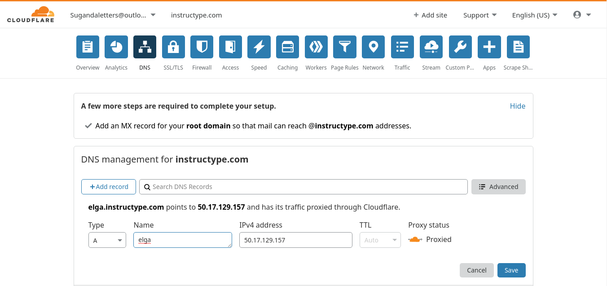
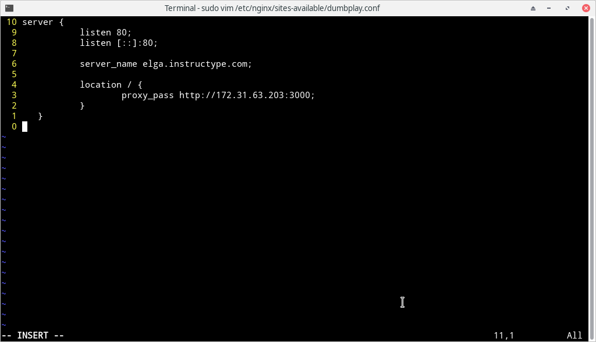

# Custom Domain

- Tambahkan DNS dari cloudflare dengan memasukkan nama sub-domain dan elastic ip dari Server Public

- Edit file dumplay.conf pada directory `etc/nginx/sites-available` dan ganti server_name menjadi elga.instructype.com

- Tes akses website menggunakan server_name yang baru

