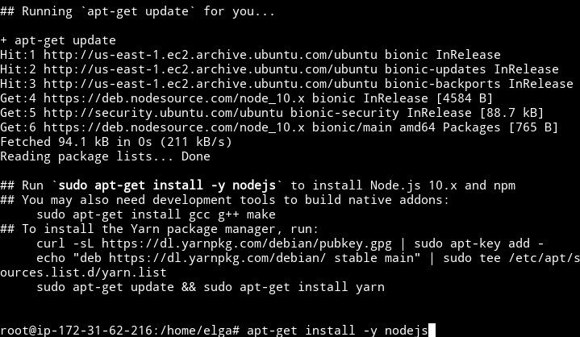
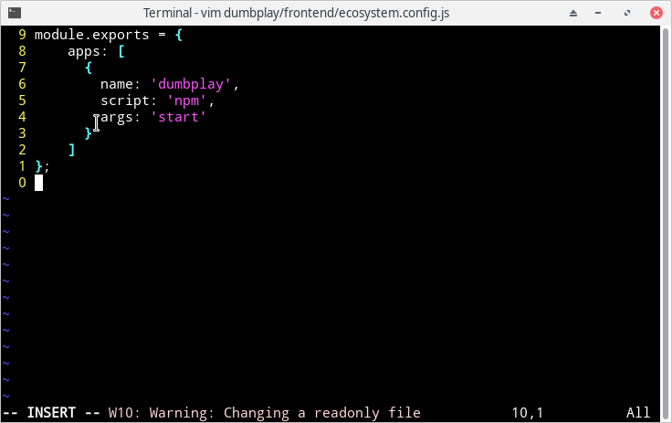

# DEPLOY APLIKASI MENGGUNAKAN PM2

- Setelah menjalankan SSH dari Server Public yang saya lakukan ialah:

	- Menjalankan perintah `sudo su` agar menjadi super user sehingga tidak perlu lagi menambahkan perintah `sudo` disetiap perintah.
	- Mengupdate dan upgrade apt dengan perintah `apt update && apt upgrade`
	- Install nodejs menggunakan perintah 
	
	```
	curl -sL https://deb.nodesource.com/setup_10.x | bash -
	apt-get install -y nodejs
	```



- Setelah proses instalasi selesai, saya jalankan perintah `git clone https://github.com/sgnd/dumbplay.git` 


- CD ke `dumplay/frontend` dan buat file baru bernama ecosystem.config.js dan isi dengan pengaturan PM2



- install PM2 dengan perintah `npm install -g pm2` dan jalankan perintah `pm2 start ecosystem.config.js` setelah instalasi selesai 

